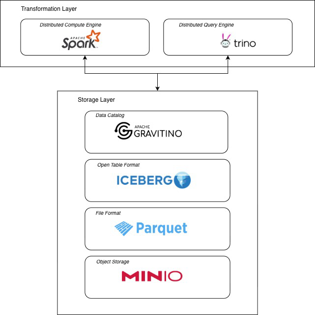

# Local Data Lakehouse Iceberg
<p align="center">
    
    <p align="center">
        Figure 1: Data Lakehouse Architecture.
    </p>
</p>

## Project Summary
This project is about running and experimenting with local data lakehouse.

## Project Scope
The goal is to create local data lakehouse using Iceberg open table format.

## Project Documentation Link
You can visit about the project explanation in this <a href="https://medium.com/@aw_marcell/how-to-build-your-own-local-data-lakehouse-using-open-source-tools-c5a8626d10f7">Medium blog</a>.

## Technologies and Libraries

### Technologies
- **Apache Gravitino** – for Iceberg REST Catalog.
- **Apache Spark** – for distributed compute engine.
- **Trino** – for distributed query engine.
- **PostgreSQL** – for Iceberg REST Catalog storage systems.
- **MiniIO** – for data lake.
- **Apache Iceberg** - open table format.

### Python Libraries for Apache Spark
- **ipython** – for better interactive Python environment for testing Spark code.
- **pandas** – for working with tabular data easily (DataFrames).
- **pyarrow** – for faster data transfer between Spark and Pandas.
- **numpy** – for numerical and array operations.
- **pyspark** – a Python API to intract with Apache Spark.


## Installation and Setup
This setup guide assumes you have Docker.

1. **Clone the repository**
   ```shell
   git clone https://github.com/marcellinus-witarsah/local-data-lakehouse-iceberg.git
   cd local-data-lakehouse-iceberg
   ```

2. **Run all of the infrastructure**
   ```shell
   docker compose up --detach --build
   ```

3. **Create schema if not exists**
   ```shell
   docker exec -it spark-master bash
   spark-sql -f /opt/spark/apps/setup/create_schema.sql 
   ```

## Experiment
You can create your python pipeline inside the `pipelines/` folder. Usually it contains transformation operations but for this I just perform a table creation. You only need to run this command inside bash shell of spark-master container. 
```shell
python /opt/spark/apps/pipelines/create_example_table.py
```

To see the table that you just create, you can go inside either the Trino CLI or Spark CLI.
```shell
docker exec -it spark-master spark-sql
select * from catalog_iceberg.schema_iceberg.table_iceberg;
```
or
```shell
docker exec -it trino trino
select * from catalog_iceberg.schema_iceberg.table_iceberg;
```
